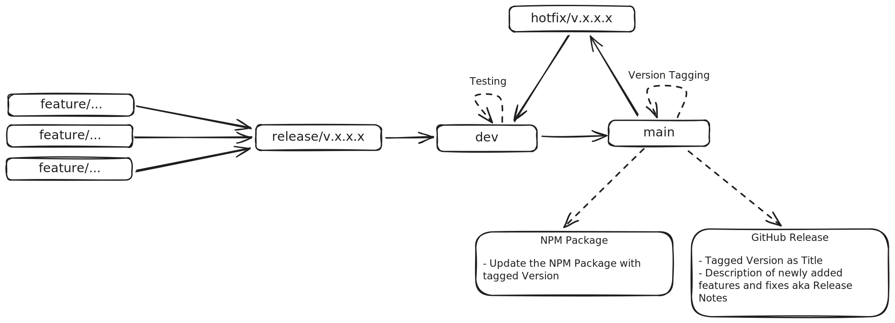

# Git Strategy

## Branches
- `main`
- `dev`
- `release/v*.*.*`
- `hotfix/v*.*.*`
- `feature/**`
- `fix/**`

- `release` branches are created from the `dev` branch as it contains all the most current features and fixes. After all the release's implementations and other tasks are done, the `release` branch is then merged back into the `dev` branch.
- `feature` and `fix` branches are created from the `release` branch they belong to. After the feature or fix is implemented the branch is then merged back into the `release` branch. This way each new `feature` and `fix` branch is based on the latest implementations in that release.
- `hotfix` branches are created from the `main` branch, as a hotfix fixes a bug on a productive version. They are then merged back into the `main` branch, as well as into the `dev` branch, to keep both of them up to date.

## Versioning
- `release` branches always describe *MAJOR* and *MINOR* version increases. That means only the first two digits of the version Tag are influenced by changes made within releases.
- `hotfix` branches only increase the *PATCH*, the last digit of the version Tag.
- Criteria for what defines a *PATCH*, *MINOR* or *MAJOR* Version are derived from the [Semantic Version](https://semver.org/) ruleset.
